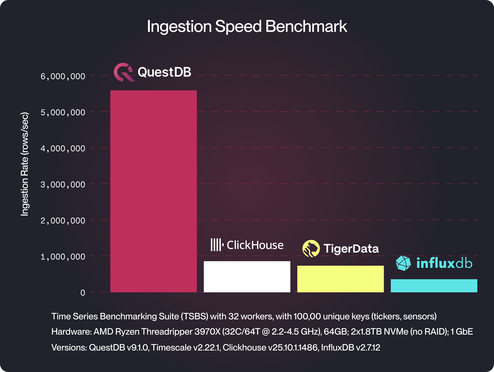

<div align="center">
  <a href="https://questdb.com/" target="blank"></a>
</div>
<p>&nbsp;</p>

<p align="center">
  <a href="#contribute">
    
  </a>
</p>

<p align="center">
  <a href="https://github.com/questdb/questdb">English</a> |
  <a href="./README.zh-cn.md">简体中文</a> |
  <a href="./README.zh-hk.md">繁體中文</a> |
  <a href="./README.ar-dz.md">العربية</a> |
  <a href="./README.it-it.md">Italiano</a> |
  <a href="./README.ua-ua.md">Українська</a> |
  <a href="./README.es-es.md">Español</a> |
  <a href="./README.pt.md">Português</a> |
  <a href="./README.fr-fr.md">Français</a> |
  <a href="./README.de-de.md">Deutsch</a> |
  <a href="./README.ja-ja.md">日本語</a> |
  한국어 |
  <a href="./README.he-il.md">עברית</a> |
  <a href="./README.nl-nl.md">Nederlands</a> |
  <a href="./README.tr-tr.md">Türkçe</a> |
  <a href="./README.hn-in.md">हिंदी</a> |
  <a href="./README.vi-vn.md">Tiếng Việt</a> |
  <a href="./README.ms-my.md">Bahasa Melayu</a>
</p>

---

QuestDB는 **초고속 데이터 수집**과 **동적이고 낮은 지연 시간의 SQL 쿼리**를 제공하는 오픈소스 시계열 데이터베이스입니다.

QuestDB는 다층 스토리지 엔진(WAL → 네이티브 → 객체 스토리지의 Parquet)을 제공하며,
핵심 엔진은 제로-GC Java와 C++로 구현되었습니다. QuestDB Enterprise는 Rust로 구현된 추가 구성 요소를 포함합니다.

우리는 컬럼 지향 스토리지 모델, 병렬화된 벡터 실행, SIMD 명령어, 그리고 낮은 지연 시간 기술을 통해 높은 성능을 달성합니다.
또한 QuestDB는 하드웨어 효율적이며, 빠른 설정과 운영 효율성을 제공합니다.

> 시작할 준비가 되셨나요? [시작하기](#시작하기) 섹션으로 이동하세요.

<p>&nbsp;</p>

<div align="center">
  <a href="https://demo.questdb.com/">
    
  </a>
  <p><em>QuestDB 웹 콘솔 - 클릭하여 데모 실행</em></p>
</div>

<p>&nbsp;</p>

## QuestDB의 장점

주요 기능은 다음과 같습니다:

- 낮은 지연 시간, 높은 처리량의 데이터 수집 — 단일 이벤트부터 초당 수백만 건까지
- 시계열 확장 기능이 있는 낮은 지연 시간 SQL (ASOF JOIN, SAMPLE BY, LATEST ON)
- SIMD 가속, 병렬 실행; 적은 하드웨어에서도 빠르게 실행
- 다층 스토리지: WAL → 네이티브 컬럼형 → Parquet (시간 분할 및 시간 정렬)
- Postgres 프로토콜(PGwire)과 REST API
- 구체화된 뷰와 n차원 배열 (주문서를 위한 2D 배열 포함)
- 쿼리와 데이터 관리를 위한 웹 콘솔
- Apache 2.0 오픈소스와 오픈 포맷 — 벤더 종속성 없음
- [금융 함수](https://questdb.com/docs/reference/function/finance/)와 [주문서 분석](https://questdb.com/docs/guides/order-book/)

QuestDB가 뛰어난 분야:

- 금융 시장 데이터 (틱 데이터, 거래, 주문서, OHLC)
- 높은 데이터 카디널리티를 가진 센서/텔레메트리 데이터
- 실시간 대시보드와 모니터링

그리고 왜 시계열 데이터베이스를 사용해야 할까요?

성능과 효율성을 넘어서, 전문적인 시계열 데이터베이스를 사용하면 다음에 대해 걱정할 필요가 없습니다:

- 순서가 맞지 않는 데이터
- 중복 제거와 정확히 한 번(exactly once) 의미론
- 많은 동시 쿼리와 함께 지속적인 스트리밍 수집
- 스트리밍 데이터 (낮은 지연 시간)
- 변동성이 크고 "버스트성" 데이터
- 새 컬럼 추가 - 데이터 스트리밍 중에 "즉석에서" 스키마 변경

## QuestDB 체험, 데모 및 대시보드

[라이브 공개 데모](https://demo.questdb.com/)는 최신 QuestDB 릴리스와 샘플 데이터셋으로 구성되어 있습니다:

- 거래: 월 3천만+ 행의 라이브 암호화폐 거래 (OKX 거래소)
- FX 주문서: 주문서 FX 쌍의 라이브 차트
- 여행: 16억 행의 NYC 택시 여행 10년 데이터

우리는 또한 [Grafana 네이티브](https://questdb.com/docs/third-party-tools/grafana/) 플러그인을 사용한 몇 가지 공개 실시간 데모 대시보드를 제공합니다:

- [실시간 암호화폐 거래:](https://questdb.com/dashboards/crypto/) OKX에서 20개 이상의 자산에서 실시간으로 실행되는 거래
- [FX 주문서:](https://questdb.com/dashboards/FX-orderbook/) 주요 FX 쌍의 라이브 깊이/불균형 차트

### QuestDB 성능 vs. 다른 데이터베이스

QuestDB는 대안들과 비교했을 때 성능 벤치마크에서 매우 좋은 결과를 보입니다.

내부와 성능에 대한 자세한 내용은 다음 블로그 포스트를 참조하세요:

- [QuestDB vs InfluxDB](https://questdb.com/blog/2024/02/26/questdb-versus-influxdb/)
- [QuestDB vs Kdb+](https://questdb.com/compare/questdb-vs-kdb/)
- [QuestDB vs TimescaleDB](https://questdb.com/blog/timescaledb-vs-questdb-comparison/)
- [QuestDB vs MongoDB](https://questdb.com/blog/mongodb-time-series-benchmark-review/)

항상 그렇듯이, 여러분만의 벤치마크를 실행해보시기를 권장합니다.

<div align="center">
  
</div>

## 시작하기

[Docker](https://www.docker.com/)를 사용하여 빠르게 시작하세요:

```bash
docker run -p 9000:9000 -p 9009:9009 -p 8812:8812 questdb/questdb
```

또는 macOS 사용자는 Homebrew를 사용할 수 있습니다:

```bash
brew install questdb
brew services start questdb
```

```bash
questdb start
questdb stop
```

또는 전체 온보딩 여정을 시작하려면 간결한
[빠른 시작 가이드](https://questdb.com/docs/quick-start/)부터 시작하세요.

### 자체 수집 클라이언트

InfluxDB Line Protocol을 통해 데이터를 수집하는 QuestDB 클라이언트:

- [Python](https://questdb.com/docs/clients/ingest-python/)
- [.NET](https://questdb.com/docs/clients/ingest-dotnet/)
- [C/C++](https://questdb.com/docs/clients/ingest-c-and-cpp/)
- [Go](https://questdb.com/docs/clients/ingest-go/)
- [Java](https://questdb.com/docs/clients/java_ilp/)
- [NodeJS](https://questdb.com/docs/clients/ingest-node/)
- [Rust](https://questdb.com/docs/clients/ingest-rust/)

### QuestDB에 연결

다음 인터페이스를 통해 QuestDB와 데이터와 상호작용하세요:

- 포트 `9000`에서 대화형 SQL 편집기와 CSV 가져오기를 위한 [웹 콘솔](https://questdb.com/docs/web-console/)
- 포트 `9000`에서 스트리밍 수집을 위한 [InfluxDB Line Protocol](https://questdb.com/docs/reference/api/ilp/overview/)
- 포트 `8812`에서 프로그래밍 방식 쿼리를 위한 [PostgreSQL Wire Protocol](https://questdb.com/docs/reference/api/postgres/)
- 포트 `9000`에서 CSV 가져오기와 cURL을 위한 [REST API](https://questdb.com/docs/reference/api/rest/)

### 인기 있는 서드파티 도구

QuestDB와 통합되는 인기 있는 도구들:

- [Kafka](https://questdb.com/docs/third-party-tools/kafka/)
- [Redpanda](https://questdb.com/docs/third-party-tools/redpanda/)
- [Grafana](https://questdb.com/docs/third-party-tools/grafana/)
- [Polars](https://questdb.com/docs/third-party-tools/polars/)
- [Pandas](https://questdb.com/docs/third-party-tools/pandas/)
- [PowerBI](https://questdb.com/docs/third-party-tools/powerbi/)
- [Superset](https://questdb.com/docs/third-party-tools/superset/)
- [Apache Flink](https://questdb.com/docs/third-party-tools/flink/)
- [Telegraf](https://questdb.com/docs/third-party-tools/telegraf/)
- [MindsDB](https://questdb.com/docs/third-party-tools/mindsdb/)

### 엔드 투 엔드 코드 스캐폴드

스트리밍 수집부터 Grafana를 통한 시각화까지,
[빠른 시작 저장소](https://github.com/questdb/questdb-quickstart)에서 코드 스캐폴드로 시작하세요.

### 프로덕션 워크로드를 위한 QuestDB 구성

프로덕션 워크로드를 위해 QuestDB를 미세 조정하려면
[용량 계획](https://questdb.com/docs/deployment/capacity-planning/)을 참조하세요.

## QuestDB Enterprise

더 큰 규모 또는 더 큰 조직 내에서의 보안 운영을 위해.

추가 기능들:

- 고가용성과 읽기 복제본
- 다중 기본 수집
- 콜드 스토리지 통합
- 역할 기반 액세스 제어
- TLS 암호화
- 객체 스토리지를 통한 Parquet 파일의 네이티브 쿼리
- SLA 지원, 향상된 모니터링 등

자세한 내용과 연락처 정보는 [Enterprise 페이지](https://questdb.com/enterprise/)를 참조하세요.

## 추가 리소스

### 📚 문서 읽기

- [QuestDB 문서:](https://questdb.com/docs/) 여정을 시작하세요
- [제품 로드맵:](https://github.com/orgs/questdb/projects/1/views/5)
  예정된 릴리스에 대한 계획을 확인하세요
- [튜토리얼:](https://questdb.com/tutorial/) QuestDB로 가능한 것을 단계별로 학습하세요

### ❓ 지원 받기

- [커뮤니티 디스커스 포럼:](https://community.questdb.com/) 기술 토론에 참여하고, 질문하고, 다른 사용자들을 만나보세요!
- [공개 Slack:](https://slack.questdb.com/) QuestDB 팀과 커뮤니티 구성원들과 채팅하세요
- [GitHub 이슈:](https://github.com/questdb/questdb/issues) QuestDB의 버그나 문제를 신고하세요
- [Stack Overflow:](https://stackoverflow.com/questions/tagged/questdb) 일반적인 문제 해결 솔루션을 찾아보세요

### 🚢 QuestDB 배포

- [AWS AMI](https://questdb.com/docs/guides/aws-official-ami)
- [Google Cloud Platform](https://questdb.com/docs/guides/google-cloud-platform)
- [공식 Docker 이미지](https://questdb.com/docs/get-started/docker)
- [DigitalOcean 드롭릿](https://questdb.com/docs/guides/digitalocean)
- [Kubernetes Helm 차트](https://questdb.com/docs/guides/kubernetes)

## 기여하기

기여를 환영합니다!

우리가 감사하게 생각하는 것들:

- 소스 코드
- 문서 ([문서 저장소](https://github.com/questdb/documentation) 참조)
- 버그 리포트
- 기능 요청이나 피드백

기여를 시작하려면:

- "[Good first issue](https://github.com/questdb/questdb/issues?q=is%3Aissue+is%3Aopen+label%3A%22Good+first+issue%22)"
  라벨이 있는 GitHub 이슈들을 살펴보세요
- Hacktoberfest의 경우, 관련
  [라벨이 있는 이슈들](https://github.com/questdb/questdb/issues?q=is%3Aissue+is%3Aopen+label%3Ahacktoberfest)을 확인하세요
- [기여 가이드](https://github.com/questdb/questdb/blob/master/CONTRIBUTING.md)를 읽어보세요
- QuestDB 빌드에 대한 자세한 내용은
  [빌드 지침](https://github.com/questdb/questdb/blob/master/core/README.md)을 참조하세요
- QuestDB를 [포크](https://docs.github.com/en/github/getting-started-with-github/fork-a-repo)하고
  제안하신 변경사항과 함께 풀 리퀘스트를 제출하세요
- 막히셨나요? 도움을 위해 [공개 Slack](https://slack.questdb.com/)에 참여하세요

✨ 감사의 표시로, 기여자들에게 QuestDB 굿즈를 보내드립니다!

QuestDB에 기여해주신 다음의 훌륭한 분들께 큰 감사를 드립니다
([이모지 키](https://allcontributors.org/docs/en/emoji-key)):

<!-- ALL-CONTRIBUTORS-LIST:START - Do not remove or modify this section -->
<!-- prettier-ignore-start -->
<!-- markdownlint-disable -->
<table>
  <tbody>
    <tr>
      <td align="center" valign="top" width="14.28%"><a href="https://github.com/clickingbuttons"><br /><sub><b>clickingbuttons</b></sub></a><br /><a href="https://github.com/questdb/questdb/commits?author=clickingbuttons" title="Code">💻</a> <a href="#ideas-clickingbuttons" title="Ideas, Planning, & Feedback">🤔</a> <a href="#userTesting-clickingbuttons" title="User Testing">📓</a></td>
      <td align="center" valign="top" width="14.28%"><a href="https://github.com/ideoma"><br /><sub><b>ideoma</b></sub></a><br /><a href="https://github.com/questdb/questdb/commits?author=ideoma" title="Code">💻</a> <a href="#userTesting-ideoma" title="User Testing">📓</a> <a href="https://github.com/questdb/questdb/commits?author=ideoma" title="Tests">⚠️</a></td>
      <td align="center" valign="top" width="14.28%"><a href="https://github.com/tonytamwk"><br /><sub><b>tonytamwk</b></sub></a><br /><a href="https://github.com/questdb/questdb/commits?author=tonytamwk" title="Code">💻</a> <a href="#userTesting-tonytamwk" title="User Testing">📓</a></td>
      <td align="center" valign="top" width="14.28%"><a href="http://sirinath.com/"><br /><sub><b>sirinath</b></sub></a><br /><a href="#ideas-sirinath" title="Ideas, Planning, & Feedback">🤔</a></td>
      <td align="center" valign="top" width="14.28%"><a href="https://www.linkedin.com/in/suhorukov"><br /><sub><b>igor-suhorukov</b></sub></a><br /><a href="https://github.com/questdb/questdb/commits?author=igor-suhorukov" title="Code">💻</a> <a href="#ideas-igor-suhorukov" title="Ideas, Planning, & Feedback">🤔</a></td>
      <td align="center" valign="top" width="14.28%"><a href="https://github.com/mick2004"><br /><sub><b>mick2004</b></sub></a><br /><a href="https://github.com/questdb/questdb/commits?author=mick2004" title="Code">💻</a> <a href="#platform-mick2004" title="Packaging/porting to new platform">📦</a></td>
      <td align="center" valign="top" width="14.28%"><a href="https://rawkode.com"><br /><sub><b>rawkode</b></sub></a><br /><a href="https://github.com/questdb/questdb/commits?author=rawkode" title="Code">💻</a> <a href="#infra-rawkode" title="Infrastructure (Hosting, Build-Tools, etc)">🚇</a></td>
    </tr>
    <tr>
      <td align="center" valign="top" width="14.28%"><a href="https://solidnerd.dev"><br /><sub><b>solidnerd</b></sub></a><br /><a href="https://github.com/questdb/questdb/commits?author=solidnerd" title="Code">💻</a> <a href="#infra-solidnerd" title="Infrastructure (Hosting, Build-Tools, etc)">🚇</a></td>
      <td align="center" valign="top" width="14.28%"><a href="http://solanav.github.io"><br /><sub><b>solanav</b></sub></a><br /><a href="https://github.com/questdb/questdb/commits?author=solanav" title="Code">💻</a> <a href="https://github.com/questdb/questdb/commits?author=solanav" title="Documentation">📖</a></td>
      <td align="center" valign="top" width="14.28%"><a href="https://shantanoo-desai.github.io"><br /><sub><b>shantanoo-desai</b></sub></a><br /><a href="#blog-shantanoo-desai" title="Blogposts">📝</a> <a href="#example-shantanoo-desai" title="Examples">💡</a></td>
      <td align="center" valign="top" width="14.28%"><a href="http://alexprut.com"><br /><sub><b>alexprut</b></sub></a><br /><a href="https://github.com/questdb/questdb/commits?author=alexprut" title="Code">💻</a> <a href="#maintenance-alexprut" title="Maintenance">🚧</a></td>
      <td align="center" valign="top" width="14.28%"><a href="https://github.com/lbowman"><br /><sub><b>lbowman</b></sub></a><br /><a href="https://github.com/questdb/questdb/commits?author=lbowman" title="Code">💻</a> <a href="https://github.com/questdb/questdb/commits?author=lbowman" title="Tests">⚠️</a></td>
      <td align="center" valign="top" width="14.28%"><a href="https://tutswiki.com/"><br /><sub><b>chankeypathak</b></sub></a><br /><a href="#blog-chankeypathak" title="Blogposts">📝</a></td>
      <td align="center" valign="top" width="14.28%"><a href="https://github.com/upsidedownsmile"><br /><sub><b>upsidedownsmile</b></sub></a><br /><a href="https://github.com/questdb/questdb/commits?author=upsidedownsmile" title="Code">💻</a></td>
    </tr>
    <tr>
      <td align="center" valign="top" width="14.28%"><a href="https://github.com/Nagriar"><br /><sub><b>Nagriar</b></sub></a><br /><a href="https://github.com/questdb/questdb/commits?author=Nagriar" title="Code">💻</a></td>
      <td align="center" valign="top" width="14.28%"><a href="https://github.com/piotrrzysko"><br /><sub><b>piotrrzysko</b></sub></a><br /><a href="https://github.com/questdb/questdb/commits?author=piotrrzysko" title="Code">💻</a> <a href="https://github.com/questdb/questdb/commits?author=piotrrzysko" title="Tests">⚠️</a></td>
      <td align="center" valign="top" width="14.28%"><a href="https://github.com/mpsq/dotfiles"><br /><sub><b>mpsq</b></sub></a><br /><a href="https://github.com/questdb/questdb/commits?author=mpsq" title="Code">💻</a></td>
      <td align="center" valign="top" width="14.28%"><a href="https://github.com/siddheshlatkar"><br /><sub><b>siddheshlatkar</b></sub></a><br /><a href="https://github.com/questdb/questdb/commits?author=siddheshlatkar" title="Code">💻</a></td>
      <td align="center" valign="top" width="14.28%"><a href="http://yitaekhwang.com"><br /><sub><b>Yitaek</b></sub></a><br /><a href="#tutorial-Yitaek" title="Tutorials">✅</a> <a href="#example-Yitaek" title="Examples">💡</a></td>
      <td align="center" valign="top" width="14.28%"><a href="https://www.gaboros.hu"><br /><sub><b>gabor-boros</b></sub></a><br /><a href="#tutorial-gabor-boros" title="Tutorials">✅</a> <a href="#example-gabor-boros" title="Examples">💡</a></td>
      <td align="center" valign="top" width="14.28%"><a href="https://github.com/kovid-r"><br /><sub><b>kovid-r</b></sub></a><br /><a href="#tutorial-kovid-r" title="Tutorials">✅</a> <a href="#example-kovid-r" title="Examples">💡</a></td>
    </tr>
    <tr>
      <td align="center" valign="top" width="14.28%"><a href="https://borowski-software.de/"><br /><sub><b>TimBo93</b></sub></a><br /><a href="https://github.com/questdb/questdb/issues?q=author%3ATimBo93" title="Bug reports">🐛</a> <a href="#userTesting-TimBo93" title="User Testing">📓</a></td>
      <td align="center" valign="top" width="14.28%"><a href="http://zikani.me"><br /><sub><b>zikani03</b></sub></a><br /><a href="https://github.com/questdb/questdb/commits?author=zikani03" title="Code">💻</a></td>
      <td align="center" valign="top" width="14.28%"><a href="https://github.com/jaugsburger"><br /><sub><b>jaugsburger</b></sub></a><br /><a href="https://github.com/questdb/questdb/commits?author=jaugsburger" title="Code">💻</a> <a href="#maintenance-jaugsburger" title="Maintenance">🚧</a></td>
      <td align="center" valign="top" width="14.28%"><a href="http://www.questdb.com"><br /><sub><b>TheTanc</b></sub></a><br /><a href="#projectManagement-TheTanc" title="Project Management">📆</a> <a href="#content-TheTanc" title="Content">🖋</a> <a href="#ideas-TheTanc" title="Ideas, Planning, & Feedback">🤔</a></td>
      <td align="center" valign="top" width="14.28%"><a href="http://davidgs.com"><br /><sub><b>davidgs</b></sub></a><br /><a href="https://github.com/questdb/questdb/issues?q=author%3Adavidgs" title="Bug reports">🐛</a> <a href="#content-davidgs" title="Content">🖋</a></td>
      <td align="center" valign="top" width="14.28%"><a href="https://redalemeden.com"><br /><sub><b>kaishin</b></sub></a><br /><a href="https://github.com/questdb/questdb/commits?author=kaishin" title="Code">💻</a> <a href="#example-kaishin" title="Examples">💡</a></td>
      <td align="center" valign="top" width="14.28%"><a href="https://questdb.com"><br /><sub><b>bluestreak01</b></sub></a><br /><a href="https://github.com/questdb/questdb/commits?author=bluestreak01" title="Code">💻</a> <a href="#maintenance-bluestreak01" title="Maintenance">🚧</a> <a href="https://github.com/questdb/questdb/commits?author=bluestreak01" title="Tests">⚠️</a></td>
    </tr>
    <tr>
      <td align="center" valign="top" width="14.28%"><a href="http://patrick.spacesurfer.com/"><br /><sub><b>patrickSpaceSurfer</b></sub></a><br /><a href="https://github.com/questdb/questdb/commits?author=patrickSpaceSurfer" title="Code">💻</a> <a href="#maintenance-patrickSpaceSurfer" title="Maintenance">🚧</a> <a href="https://github.com/questdb/questdb/commits?author=patrickSpaceSurfer" title="Tests">⚠️</a></td>
      <td align="center" valign="top" width="14.28%"><a href="http://chenrui.dev"><br /><sub><b>chenrui333</b></sub></a><br /><a href="#infra-chenrui333" title="Infrastructure (Hosting, Build-Tools, etc)">🚇</a></td>
      <td align="center" valign="top" width="14.28%"><a href="http://bsmth.de"><br /><sub><b>bsmth</b></sub></a><br /><a href="https://github.com/questdb/questdb/commits?author=bsmth" title="Documentation">📖</a> <a href="#content-bsmth" title="Content">🖋</a></td>
      <td align="center" valign="top" width="14.28%"><a href="https://github.com/Ugbot"><br /><sub><b>Ugbot</b></sub></a><br /><a href="#question-Ugbot" title="Answering Questions">💬</a> <a href="#userTesting-Ugbot" title="User Testing">📓</a> <a href="#talk-Ugbot" title="Talks">📢</a></td>
      <td align="center" valign="top" width="14.28%"><a href="https://github.com/lepolac"><br /><sub><b>lepolac</b></sub></a><br /><a href="https://github.com/questdb/questdb/commits?author=lepolac" title="Code">💻</a> <a href="#tool-lepolac" title="Tools">🔧</a></td>
      <td align="center" valign="top" width="14.28%"><a href="https://github.com/tiagostutz"><br /><sub><b>tiagostutz</b></sub></a><br /><a href="#userTesting-tiagostutz" title="User Testing">📓</a> <a href="https://github.com/questdb/questdb/issues?q=author%3Atiagostutz" title="Bug reports">🐛</a> <a href="#projectManagement-tiagostutz" title="Project Management">📆</a></td>
      <td align="center" valign="top" width="14.28%"><a href="https://github.com/Lyncee59"><br /><sub><b>Lyncee59</b></sub></a><br /><a href="#ideas-Lyncee59" title="Ideas, Planning, & Feedback">🤔</a> <a href="https://github.com/questdb/questdb/commits?author=Lyncee59" title="Code">💻</a></td>
    </tr>
    <tr>
      <td align="center" valign="top" width="14.28%"><a href="https://github.com/rrjanbiah"><br /><sub><b>rrjanbiah</b></sub></a><br /><a href="https://github.com/questdb/questdb/issues?q=author%3Arrjanbiah" title="Bug reports">🐛</a></td>
      <td align="center" valign="top" width="14.28%"><a href="https://github.com/sarunas-stasaitis"><br /><sub><b>sarunas-stasaitis</b></sub></a><br /><a href="https://github.com/questdb/questdb/issues?q=author%3Asarunas-stasaitis" title="Bug reports">🐛</a></td>
      <td align="center" valign="top" width="14.28%"><a href="https://github.com/RiccardoGiro"><br /><sub><b>RiccardoGiro</b></sub></a><br /><a href="https://github.com/questdb/questdb/issues?q=author%3ARiccardoGiro" title="Bug reports">🐛</a></td>
      <td align="center" valign="top" width="14.28%"><a href="https://github.com/duggar"><br /><sub><b>duggar</b></sub></a><br /><a href="https://github.com/questdb/questdb/issues?q=author%3Aduggar" title="Bug reports">🐛</a></td>
      <td align="center" valign="top" width="14.28%"><a href="https://github.com/postol"><br /><sub><b>postol</b></sub></a><br /><a href="https://github.com/questdb/questdb/issues?q=author%3Apostol" title="Bug reports">🐛</a></td>
      <td align="center" valign="top" width="14.28%"><a href="https://github.com/petrjahoda"><br /><sub><b>petrjahoda</b></sub></a><br /><a href="https://github.com/questdb/questdb/issues?q=author%3Apetrjahoda" title="Bug reports">🐛</a></td>
      <td align="center" valign="top" width="14.28%"><a href="https://www.turecki.net"><br /><sub><b>t00</b></sub></a><br /><a href="https://github.com/questdb/questdb/issues?q=author%3At00" title="Bug reports">🐛</a></td>
    </tr>
    <tr>
      <td align="center" valign="top" width="14.28%"><a href="https://github.com/snenkov"><br /><sub><b>snenkov</b></sub></a><br /><a href="#userTesting-snenkov" title="User Testing">📓</a> <a href="https://github.com/questdb/questdb/issues?q=author%3Asnenkov" title="Bug reports">🐛</a> <a href="#ideas-snenkov" title="Ideas, Planning, & Feedback">🤔</a></td>
      <td align="center" valign="top" width="14.28%"><a href="https://www.linkedin.com/in/marregui"><br /><sub><b>marregui</b></sub></a><br /><a href="https://github.com/questdb/questdb/commits?author=marregui" title="Code">💻</a> <a href="#ideas-marregui" title="Ideas, Planning, & Feedback">🤔</a> <a href="#design-marregui" title="Design">🎨</a></td>
      <td align="center" valign="top" width="14.28%"><a href="https://github.com/bratseth"><br /><sub><b>bratseth</b></sub></a><br /><a href="https://github.com/questdb/questdb/commits?author=bratseth" title="Code">💻</a> <a href="#ideas-bratseth" title="Ideas, Planning, & Feedback">🤔</a> <a href="#userTesting-bratseth" title="User Testing">📓</a></td>
      <td align="center" valign="top" width="14.28%"><a href="https://medium.com/@wellytambunan/"><br /><sub><b>welly87</b></sub></a><br /><a href="#ideas-welly87" title="Ideas, Planning, & Feedback">🤔</a></td>
      <td align="center" valign="top" width="14.28%"><a href="http://johnleung.com"><br /><sub><b>fuzzthink</b></sub></a><br /><a href="#ideas-fuzzthink" title="Ideas, Planning, & Feedback">🤔</a> <a href="#userTesting-fuzzthink" title="User Testing">📓</a></td>
      <td align="center" valign="top" width="14.28%"><a href="https://github.com/nexthack"><br /><sub><b>nexthack</b></sub></a><br /><a href="https://github.com/questdb/questdb/commits?author=nexthack" title="Code">💻</a></td>
      <td align="center" valign="top" width="14.28%"><a href="https://github.com/g-metan"><br /><sub><b>g-metan</b></sub></a><br /><a href="https://github.com/questdb/questdb/issues?q=author%3Ag-metan" title="Bug reports">🐛</a></td>
    </tr>
    <tr>
      <td align="center" valign="top" width="14.28%"><a href="https://github.com/tim2skew"><br /><sub><b>tim2skew</b></sub></a><br /><a href="https://github.com/questdb/questdb/issues?q=author%3Atim2skew" title="Bug reports">🐛</a> <a href="#userTesting-tim2skew" title="User Testing">📓</a></td>
      <td align="center" valign="top" width="14.28%"><a href="https://github.com/ospqsp"><br /><sub><b>ospqsp</b></sub></a><br /><a href="https://github.com/questdb/questdb/issues?q=author%3Aospqsp" title="Bug reports">🐛</a></td>
      <td align="center" valign="top" width="14.28%"><a href="https://github.com/SuperFluffy"><br /><sub><b>SuperFluffy</b></sub></a><br /><a href="https://github.com/questdb/questdb/issues?q=author%3ASuperFluffy" title="Bug reports">🐛</a></td>
      <td align="center" valign="top" width="14.28%"><a href="https://github.com/nu11ptr"><br /><sub><b>nu11ptr</b></sub></a><br /><a href="https://github.com/questdb/questdb/issues?q=author%3Anu11ptr" title="Bug reports">🐛</a></td>
      <td align="center" valign="top" width="14.28%"><a href="https://github.com/comunidadio"><br /><sub><b>comunidadio</b></sub></a><br /><a href="https://github.com/questdb/questdb/issues?q=author%3Acomunidadio" title="Bug reports">🐛</a></td>
      <td align="center" valign="top" width="14.28%"><a href="https://github.com/mugendi"><br /><sub><b>mugendi</b></sub></a><br /><a href="#ideas-mugendi" title="Ideas, Planning, & Feedback">🤔</a> <a href="https://github.com/questdb/questdb/issues?q=author%3Amugendi" title="Bug reports">🐛</a> <a href="https://github.com/questdb/questdb/commits?author=mugendi" title="Documentation">📖</a></td>
      <td align="center" valign="top" width="14.28%"><a href="https://github.com/paulwoods222"><br /><sub><b>paulwoods222</b></sub></a><br /><a href="https://github.com/questdb/questdb/issues?q=author%3Apaulwoods222" title="Bug reports">🐛</a></td>
    </tr>
    <tr>
      <td align="center" valign="top" width="14.28%"><a href="https://github.com/mingodad"><br /><sub><b>mingodad</b></sub></a><br /><a href="#ideas-mingodad" title="Ideas, Planning, & Feedback">🤔</a> <a href="https://github.com/questdb/questdb/issues?q=author%3Amingodad" title="Bug reports">🐛</a> <a href="https://github.com/questdb/questdb/commits?author=mingodad" title="Documentation">📖</a></td>
      <td align="center" valign="top" width="14.28%"><a href="https://github.com/houarizegai"><br /><sub><b>houarizegai</b></sub></a><br /><a href="https://github.com/questdb/questdb/commits?author=houarizegai" title="Documentation">📖</a></td>
      <td align="center" valign="top" width="14.28%"><a href="http://scrapfly.io"><br /><sub><b>jjsaunier</b></sub></a><br /><a href="https://github.com/questdb/questdb/issues?q=author%3Ajjsaunier" title="Bug reports">🐛</a></td>
      <td align="center" valign="top" width="14.28%"><a href="https://github.com/zanek"><br /><sub><b>zanek</b></sub></a><br /><a href="#ideas-zanek" title="Ideas, Planning, & Feedback">🤔</a> <a href="#projectManagement-zanek" title="Project Management">📆</a></td>
      <td align="center" valign="top" width="14.28%"><a href="https://github.com/Geekaylee"><br /><sub><b>Geekaylee</b></sub></a><br /><a href="#userTesting-Geekaylee" title="User Testing">📓</a> <a href="#ideas-Geekaylee" title="Ideas, Planning, & Feedback">🤔</a></td>
      <td align="center" valign="top" width="14.28%"><a href="https://github.com/lg31415"><br /><sub><b>lg31415</b></sub></a><br /><a href="https://github.com/questdb/questdb/issues?q=author%3Alg31415" title="Bug reports">🐛</a> <a href="#projectManagement-lg31415" title="Project Management">📆</a></td>
      <td align="center" valign="top" width="14.28%"><a href="http://nulldev.xyz/"><br /><sub><b>null-dev</b></sub></a><br /><a href="https://github.com/questdb/questdb/issues?q=author%3Anull-dev" title="Bug reports">🐛</a> <a href="#projectManagement-null-dev" title="Project Management">📆</a></td>
    </tr>
    <tr>
      <td align="center" valign="top" width="14.28%"><a href="http://ultd.io"><br /><sub><b>ultd</b></sub></a><br /><a href="#ideas-ultd" title="Ideas, Planning, & Feedback">🤔</a> <a href="#projectManagement-ultd" title="Project Management">📆</a></td>
      <td align="center" valign="top" width="14.28%"><a href="https://github.com/ericsun2"><br /><sub><b>ericsun2</b></sub></a><br /><a href="#ideas-ericsun2" title="Ideas, Planning, & Feedback">🤔</a> <a href="https://github.com/questdb/questdb/issues?q=author%3Aericsun2" title="Bug reports">🐛</a> <a href="#projectManagement-ericsun2" title="Project Management">📆</a></td>
      <td align="center" valign="top" width="14.28%"><a href="https://www.linkedin.com/in/giovanni-k-bonetti-2809345/"><br /><sub><b>giovannibonetti</b></sub></a><br /><a href="#userTesting-giovannibonetti" title="User Testing">📓</a> <a href="https://github.com/questdb/questdb/issues?q=author%3Agiovannibonetti" title="Bug reports">🐛</a> <a href="#projectManagement-giovannibonetti" title="Project Management">📆</a></td>
      <td align="center" valign="top" width="14.28%"><a href="https://wavded.com"><br /><sub><b>wavded</b></sub></a><br /><a href="#userTesting-wavded" title="User Testing">📓</a> <a href="https://github.com/questdb/questdb/issues?q=author%3Awavded" title="Bug reports">🐛</a></td>
      <td align="center" valign="top" width="14.28%"><a href="https://medium.com/@apechkurov"><br /><sub><b>puzpuzpuz</b></sub></a><br /><a href="https://github.com/questdb/questdb/commits?author=puzpuzpuz" title="Documentation">📖</a> <a href="https://github.com/questdb/questdb/commits?author=puzpuzpuz" title="Code">💻</a> <a href="#userTesting-puzpuzpuz" title="User Testing">📓</a></td>
      <td align="center" valign="top" width="14.28%"><a href="https://github.com/rstreics"><br /><sub><b>rstreics</b></sub></a><br /><a href="https://github.com/questdb/questdb/commits?author=rstreics" title="Code">💻</a> <a href="#infra-rstreics" title="Infrastructure (Hosting, Build-Tools, etc)">🚇</a> <a href="https://github.com/questdb/questdb/commits?author=rstreics" title="Documentation">📖</a></td>
      <td align="center" valign="top" width="14.28%"><a href="https://github.com/mariusgheorghies"><br /><sub><b>mariusgheorghies</b></sub></a><br /><a href="https://github.com/questdb/questdb/commits?author=mariusgheorghies" title="Code">💻</a> <a href="#infra-mariusgheorghies" title="Infrastructure (Hosting, Build-Tools, etc)">🚇</a> <a href="https://github.com/questdb/questdb/commits?author=mariusgheorghies" title="Documentation">📖</a></td>
    </tr>
    <tr>
      <td align="center" valign="top" width="14.28%"><a href="https://github.com/pswu11"><br /><sub><b>pswu11</b></sub></a><br /><a href="#content-pswu11" title="Content">🖋</a> <a href="#ideas-pswu11" title="Ideas, Planning, & Feedback">🤔</a> <a href="#design-pswu11" title="Design">🎨</a></td>
      <td align="center" valign="top" width="14.28%"><a href="https://github.com/insmac"><br /><sub><b>insmac</b></sub></a><br /><a href="https://github.com/questdb/questdb/commits?author=insmac" title="Code">💻</a> <a href="#ideas-insmac" title="Ideas, Planning, & Feedback">🤔</a> <a href="#design-insmac" title="Design">🎨</a></td>
      <td align="center" valign="top" width="14.28%"><a href="https://github.com/eugenels"><br /><sub><b>eugenels</b></sub></a><br /><a href="https://github.com/questdb/questdb/commits?author=eugenels" title="Code">💻</a> <a href="#ideas-eugenels" title="Ideas, Planning, & Feedback">🤔</a> <a href="#maintenance-eugenels" title="Maintenance">🚧</a></td>
      <td align="center" valign="top" width="14.28%"><a href="https://github.com/bziobrowski"><br /><sub><b>bziobrowski</b></sub></a><br /><a href="https://github.com/questdb/questdb/commits?author=bziobrowski" title="Code">💻</a> <a href="#projectManagement-bziobrowski" title="Project Management">📆</a></td>
      <td align="center" valign="top" width="14.28%"><a href="https://github.com/Zapfmeister"><br /><sub><b>Zapfmeister</b></sub></a><br /><a href="https://github.com/questdb/questdb/commits?author=Zapfmeister" title="Code">💻</a> <a href="#userTesting-Zapfmeister" title="User Testing">📓</a></td>
      <td align="center" valign="top" width="14.28%"><a href="https://github.com/mkaruza"><br /><sub><b>mkaruza</b></sub></a><br /><a href="https://github.com/questdb/questdb/commits?author=mkaruza" title="Code">💻</a></td>
      <td align="center" valign="top" width="14.28%"><a href="https://github.com/DylanDKnight"><br /><sub><b>DylanDKnight</b></sub></a><br /><a href="#userTesting-DylanDKnight" title="User Testing">📓</a> <a href="https://github.com/questdb/questdb/issues?q=author%3ADylanDKnight" title="Bug reports">🐛</a></td>
    </tr>
    <tr>
      <td align="center" valign="top" width="14.28%"><a href="https://github.com/enolal826"><br /><sub><b>enolal826</b></sub></a><br /><a href="https://github.com/questdb/questdb/commits?author=enolal826" title="Code">💻</a></td>
      <td align="center" valign="top" width="14.28%"><a href="https://github.com/glasstiger"><br /><sub><b>glasstiger</b></sub></a><br /><a href="https://github.com/questdb/questdb/commits?author=glasstiger" title="Code">💻</a></td>
      <td align="center" valign="top" width="14.28%"><a href="https://arijus.net"><br /><sub><b>argshook</b></sub></a><br /><a href="https://github.com/questdb/questdb/commits?author=argshook" title="Code">💻</a> <a href="#ideas-argshook" title="Ideas, Planning, & Feedback">🤔</a> <a href="#design-argshook" title="Design">🎨</a> <a href="https://github.com/questdb/questdb/issues?q=author%3Aargshook" title="Bug reports">🐛</a></td>
      <td align="center" valign="top" width="14.28%"><a href="https://github.com/amunra"><br /><sub><b>amunra</b></sub></a><br /><a href="https://github.com/questdb/questdb/commits?author=amunra" title="Code">💻</a> <a href="https://github.com/questdb/questdb/commits?author=amunra" title="Documentation">📖</a> <a href="https://github.com/questdb/questdb/issues?q=author%3Aamunra" title="Bug reports">🐛</a></td>
      <td align="center" valign="top" width="14.28%"><a href="https://lamottsjourney.wordpress.com/"><br /><sub><b>GothamsJoker</b></sub></a><br /><a href="https://github.com/questdb/questdb/commits?author=GothamsJoker" title="Code">💻</a></td>
      <td align="center" valign="top" width="14.28%"><a href="https://github.com/kocko"><br /><sub><b>kocko</b></sub></a><br /><a href="https://github.com/questdb/questdb/commits?author=kocko" title="Code">💻</a></td>
      <td align="center" valign="top" width="14.28%"><a href="https://github.com/jerrinot"><br /><sub><b>jerrinot</b></sub></a><br /><a href="https://github.com/questdb/questdb/commits?author=jerrinot" title="Code">💻</a> <a href="#ideas-jerrinot" title="Ideas, Planning, & Feedback">🤔</a> <a href="https://github.com/questdb/questdb/issues?q=author%3Ajerrinot" title="Bug reports">🐛</a></td>
    </tr>
    <tr>
      <td align="center" valign="top" width="14.28%"><a href="http://ramiroberrelleza.com"><br /><sub><b>rberrelleza</b></sub></a><br /><a href="https://github.com/questdb/questdb/commits?author=rberrelleza" title="Code">💻</a></td>
      <td align="center" valign="top" width="14.28%"><a href="https://github.com/Cobalt-27"><br /><sub><b>Cobalt-27</b></sub></a><br /><a href="https://github.com/questdb/questdb/commits?author=Cobalt-27" title="Code">💻</a></td>
      <td align="center" valign="top" width="14.28%"><a href="https://github.com/eschultz"><br /><sub><b>eschultz</b></sub></a><br /><a href="https://github.com/questdb/questdb/commits?author=eschultz" title="Code">💻</a></td>
      <td align="center" valign="top" width="14.28%"><a href="https://www.linkedin.com/in/xinyi-qiao/"><br /><sub><b>XinyiQiao</b></sub></a><br /><a href="https://github.com/questdb/questdb/commits?author=XinyiQiao" title="Code">💻</a></td>
      <td align="center" valign="top" width="14.28%"><a href="http://chenquan.me"><br /><sub><b>terasum</b></sub></a><br /><a href="https://github.com/questdb/questdb/commits?author=terasum" title="Documentation">📖</a></td>
      <td align="center" valign="top" width="14.28%"><a href="https://www.linkedin.com/in/hristovdeveloper"><br /><sub><b>PlamenHristov</b></sub></a><br /><a href="https://github.com/questdb/questdb/commits?author=PlamenHristov" title="Code">💻</a></td>
      <td align="center" valign="top" width="14.28%"><a href="https://github.com/tris0laris"><br /><sub><b>tris0laris</b></sub></a><br /><a href="#blog-tris0laris" title="Blogposts">📝</a> <a href="#ideas-tris0laris" title="Ideas, Planning, & Feedback">🤔</a></td>
    </tr>
    <tr>
      <td align="center" valign="top" width="14.28%"><a href="https://github.com/HeZean"><br /><sub><b>HeZean</b></sub></a><br /><a href="https://github.com/questdb/questdb/commits?author=HeZean" title="Code">💻</a> <a href="https://github.com/questdb/questdb/issues?q=author%3AHeZean" title="Bug reports">🐛</a></td>
      <td align="center" valign="top" width="14.28%"><a href="https://github.com/iridess"><br /><sub><b>iridess</b></sub></a><br /><a href="https://github.com/questdb/questdb/commits?author=iridess" title="Code">💻</a> <a href="https://github.com/questdb/questdb/commits?author=iridess" title="Documentation">📖</a></td>
      <td align="center" valign="top" width="14.28%"><a href="https://www.linkedin.com/in/selmanfaruky%C4%B1lmaz/"><br /><sub><b>selmanfarukyilmaz</b></sub></a><br /><a href="https://github.com/questdb/questdb/issues?q=author%3Aselmanfarukyilmaz" title="Bug reports">🐛</a></td>
      <td align="center" valign="top" width="14.28%"><a href="http://www.donet5.com"><br /><sub><b>donet5</b></sub></a><br /><a href="#ideas-donet5" title="Ideas, Planning, & Feedback">🤔</a> <a href="https://github.com/questdb/questdb/issues?q=author%3Adonet5" title="Bug reports">🐛</a></td>
      <td align="center" valign="top" width="14.28%"><a href="https://github.com/Zahlii"><br /><sub><b>Zahlii</b></sub></a><br /><a href="https://github.com/questdb/questdb/issues?q=author%3AZahlii" title="Bug reports">🐛</a></td>
      <td align="center" valign="top" width="14.28%"><a href="https://github.com/salsasepp"><br /><sub><b>salsasepp</b></sub></a><br /><a href="https://github.com/questdb/questdb/issues?q=author%3Asalsasepp" title="Bug reports">🐛</a></td>
      <td align="center" valign="top" width="14.28%"><a href="https://github.com/EmmettM"><br /><sub><b>EmmettM</b></sub></a><br /><a href="https://github.com/questdb/questdb/issues?q=author%3AEmmettM" title="Bug reports">🐛</a> <a href="https://github.com/questdb/questdb/commits?author=EmmettM" title="Tests">⚠️</a></td>
    </tr>
    <tr>
      <td align="center" valign="top" width="14.28%"><a href="https://allfactors.com"><br /><sub><b>robd003</b></sub></a><br /><a href="#ideas-robd003" title="Ideas, Planning, & Feedback">🤔</a></td>
      <td align="center" valign="top" width="14.28%"><a href="https://github.com/AllenEdison"><br /><sub><b>AllenEdison</b></sub></a><br /><a href="https://github.com/questdb/questdb/issues?q=author%3AAllenEdison" title="Bug reports">🐛</a></td>
      <td align="center" valign="top" width="14.28%"><a href="https://github.com/CSharpDummy"><br /><sub><b>CSharpDummy</b></sub></a><br /><a href="https://github.com/questdb/questdb/issues?q=author%3ACSharpDummy" title="Bug reports">🐛</a></td>
      <td align="center" valign="top" width="14.28%"><a href="https://github.com/shimondoodkin"><br /><sub><b>shimondoodkin</b></sub></a><br /><a href="https://github.com/questdb/questdb/issues?q=author%3Ashimondoodkin" title="Bug reports">🐛</a> <a href="#ideas-shimondoodkin" title="Ideas, Planning, & Feedback">🤔</a></td>
      <td align="center" valign="top" width="14.28%"><a href="https://www.zsmart.tech/"><br /><sub><b>huuhait</b></sub></a><br /><a href="https://github.com/questdb/questdb/issues?q=author%3Ahuuhait" title="Bug reports">🐛</a> <a href="#ideas-huuhait" title="Ideas, Planning, & Feedback">🤔</a></td>
      <td align="center" valign="top" width="14.28%"><a href="https://clickhouse.com/"><br /><sub><b>alexey-milovidov</b></sub></a><br /><a href="https://github.com/questdb/questdb/issues?q=author%3Aalexey-milovidov" title="Bug reports">🐛</a></td>
      <td align="center" valign="top" width="14.28%"><a href="http://blog.suconghou.cn"><br /><sub><b>suconghou</b></sub></a><br /><a href="https://github.com/questdb/questdb/issues?q=author%3Asuconghou" title="Bug reports">🐛</a></td>
    </tr>
    <tr>
      <td align="center" valign="top" width="14.28%"><a href="https://github.com/allegraharris"><br /><sub><b>allegraharris</b></sub></a><br /><a href="https://github.com/questdb/questdb/commits?author=allegraharris" title="Code">💻</a></td>
      <td align="center" valign="top" width="14.28%"><a href="https://github.com/oliver-daniel"><br /><sub><b>oliver-daniel</b></sub></a><br /><a href="https://github.com/questdb/questdb/commits?author=oliver-daniel" title="Code">💻</a></td>
      <td align="center" valign="top" width="14.28%"><a href="https://github.com/kerimsenturk5734"><br /><sub><b>kerimsenturk5734</b></sub></a><br /><a href="https://github.com/questdb/questdb/commits?author=kerimsenturk5734" title="Documentation">📖</a></td>
    </tr>
  </tbody>
</table>

<!-- markdownlint-restore -->
<!-- prettier-ignore-end -->

<!-- ALL-CONTRIBUTORS-LIST:END -->

이 프로젝트는 [all-contributors](https://github.com/all-contributors/all-contributors)
사양을 준수합니다. 모든 종류의 기여를 환영합니다!